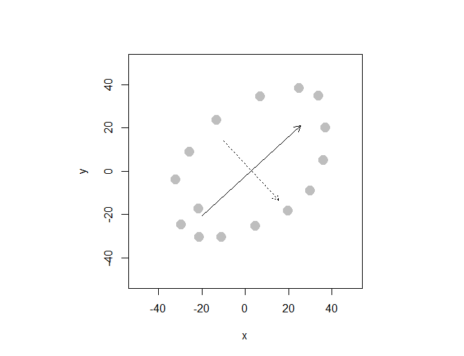
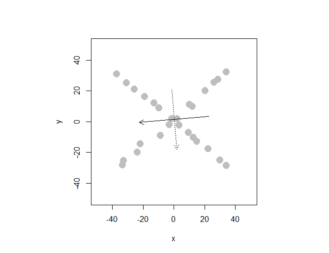

---
output:
  pdf_document:
    latex_engine: xelatex
---

## Student ID: 112077423

```{r message=FALSE}
library(ggplot2)
library(compstatslib)
library(data.table)
library(tidyr)
library(lsa)
library(readxl)
```

```{r}
cars <- read.table("auto-data.txt", header=FALSE, na.strings = "?")

names(cars) <- c("mpg", "cylinders", "displacement", "horsepower", "weight", 
                 "acceleration", "model_year", "origin", "car_name")

cars_log <- with(cars, data.frame(log(mpg), log(cylinders), log(displacement),
                                  log(horsepower), log(weight), log(acceleration), 
                                  model_year, origin))
head(cars_log)
```

```{r}
# print rows with missing values
print(cars_log[!complete.cases(cars_log),])
# delete rows with missing values
cars_log <- cars_log %>% drop_na()
```

## Question 1(a)

*Create a new data.frame of the four log-transformed variables with high multicollinearity*

```{r}
cor(cars_log)
features <- cars_log[,c('log.cylinders.', 'log.displacement.', 'log.weight.', 'log.horsepower.')]
```

*How much variance of the four variables is explained by their first principal component?*

```{r}
features_eigen <- eigen(cor(features))
features_eigen$values[1] / sum(features_eigen$values)
```

PC1 captures ~92% of variance of the dataset.

*Looking at the values and valence (positiveness/negativeness) of the first principal component’s eigenvector, what would you call the information captured by this component?*

```{r}
tmp <- features_eigen$vectors
rownames(tmp) <- c('log.cylinders.', 'log.displacement.', 'log.weight.', 'log.horsepower.')
tmp[,1]
```

The first principal component is the longest dimension of the data. Eigenvectors of the covariance matrix are actually the directions of the axes where there is the most variance (most information). Since the first principal component is strongly correlated with log.displacement. and log.weight. (>0.5), we can say that this principal component is primarily a measure of the displacement and weight. 

## Question 1(b)

*Store the scores of the first principal component as a new column of cars_log*

```{r}
scores <- prcomp(features, scale.=TRUE)$x
cars_log$pc_scores <- scores[,'PC1']
```

*Regress mpg over the column with PC1 scores (replacing cylinders, displacement, horsepower, and weight), as well as acceleration, model_year and origin*

```{r}
model <- lm(log.mpg. ~ pc_scores + log.acceleration. + model_year + factor(origin), data=cars_log)
summary(model)
```

*Try running the regression again over the same independent variables, but this time with everything standardized. How important is this new column relative to other columns?*

```{r}
model <- lm(scale(log.mpg.) ~ scale(pc_scores) + scale(log.acceleration.) + 
            scale(model_year) + factor(origin), data=cars_log)
summary(model)
```

We can see that pc_scores has the highest coefficient among all variables which means that it has a larger influence.

## Question 2(a)

```{r}
df <- read_excel('security_questions.xlsx', sheet = 2)
head(df)
```

*How much variance did each extracted factor explain?*

```{r}
df_pca <- prcomp(df, scale.=TRUE)
summary(df_pca)$importance[2,]
```
## Question 2(b)

*How many dimensions would you retain, according to the two criteria we discussed?*

```{r}
df_eigen <- eigen(cor(df))
df_eigen$values
```

```{r}
screeplot(df_pca, type="lines")
abline(h=1, col="red", lty=2)
```

I'd retain only one dimension. Despite the first 3 PCs having eigenvalues >= 1, not each of them follows screeplot criteria (where we only consider factors before the "elbow").

## Question 2(c)

*Can you interpret what any of the principal components mean? Try guessing the meaning of the first two or three PCs looking at the PC-vs-variable matrix*

The main idea of PCA is to reduce the dimensionality of a dataset. Principal components are variables that explain variation in a dataset, where the first principal component explains the most of it, and each remaining component explains the remaining variance in decreasing order.

## Question 3(a)



## Question 3(b)


