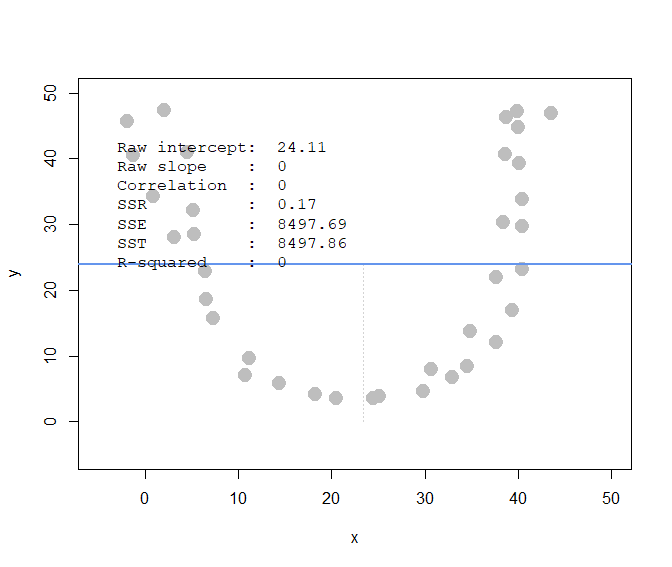
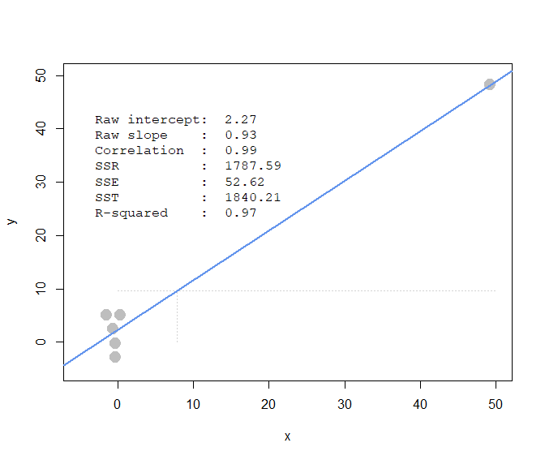
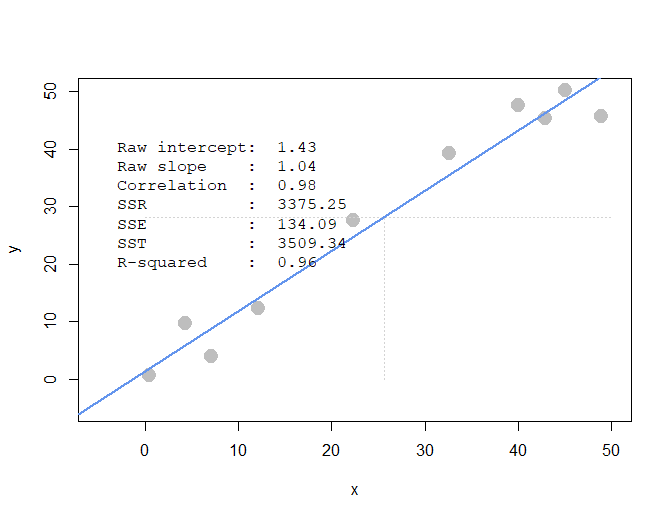

---
output:
  pdf_document:
    latex_engine: xelatex
---

## Student ID: 112077423

```{r message=FALSE}
library(ggplot2)
library(compstatslib)
library(data.table)
library(tidyr)
library(lsa)
```

## Question 1(a)

```{r}
# alternative method to read data:
ac_bundles_dt <- fread("piccollage_accounts_bundles.csv")
ac_bundles_matrix <- as.matrix(ac_bundles_dt[, -1, with=FALSE])
```

In the app at the bottom of each sticker pack, we can find 6 recommendations.

Possible recommendations for *eastersurprise*:

-   happyeaster2016

-   hellospring

-   holidaycheers

-   springrose

-   HeartStickerPack

## Question 1(b)

**(i)**

*cosine similarity*

```{r}
cosine_func <- function(mt) {
  
  cosine_matrix <- cosine(mt)
  
  cnt <- 1

  top <- matrix(ncol = 5, nrow=165)
  dimnames(top) <- list(colnames(cosine_matrix), c(1:5))

  while (cnt <= dim(cosine_matrix)[1]) {
    new_row <- tail(sort(cosine_matrix[cnt,]),6)
    top[cnt,] <- names(new_row[c(-6)])
    cnt <- cnt + 1
  } 
  
  return(top)
  
}

#cos_top_5 <- cosine_func(ac_bundles_matrix)


cosine_recos <- function(items_matrix) {
  cos_sim_matrix <- qlcMatrix::cosSparse(items_matrix)
  bundle_names <- colnames(items_matrix)
  dimnames(cos_sim_matrix) <- list(bundle_names, bundle_names)
  diag(cos_sim_matrix) <- 2
  row_recos <- function(cos_sim_row) {
    names(sort(cos_sim_row, decreasing = TRUE))
  }
  all_recos <- t(apply(cos_sim_matrix, 2, row_recos))
  final_recos <- all_recos[, -1]
  return(final_recos[, 1:5])
}

cos_top_5 <- cosine_recos(ac_bundles_matrix)
```

```{r}
cos_top_5['eastersurprise',]
```

**(ii)**

*correlation*

```{r}
bundle_means <- apply(ac_bundles_matrix, 2, mean)
bundle_means_matrix <- t(replicate(nrow(ac_bundles_matrix), bundle_means))
ac_bundles_mc_b <- ac_bundles_matrix - bundle_means_matrix
corr_top_5 <- cosine_recos(ac_bundles_mc_b)
```

```{r}
corr_top_5['eastersurprise',]
```

**(iii)**

*adjusted-cosine*

```{r}
bundle_means <- apply(ac_bundles_matrix, 1, mean)
ac_bundles_mc_b <- ac_bundles_matrix - bundle_means
adj_top_5 <- cosine_recos(ac_bundles_mc_b)
```

```{r}
adj_top_5['eastersurprise',]
```

## Question 1(c)

It is similar in a sense but not the same. Humans have biases when evaluating something.

## Question 1(d)

Cosine similarity and correlation focus on bundle similarity whereas adjusted-cosine considers similarity between individuals.

## Question 2(a)

**(i)** raw slope of x and y that is around 0

**(ii)** correlation of x and y that is around 0

## Question 2(b)

**(i)** raw slope of x and y that is around 0

**(ii)** correlation of x and y that is around 0

## Question 2(c)

**(i)** raw slope of x and y that is close to 1

**(ii)** correlation of x and y that is close to 1

## Question 2(d)

**(i)** raw slope of x and y that is close to -1

**(ii)** correlation of x and y that is close to -1

## Question 2(e)



## Question 2(f)



## Question 2(g)

**(i)**

```{r}
#pts <- interactive_regression()
# copy interactive_regression() results to pts since not able to render file that requires input
pts <- data.frame(x=c(0.4570313, 12.1660156, 22.3710938, 42.9960938, 
                      49.0117188, 45.1445313,  4.3242188,  7.1171875, 
                      32.6835938, 40.0957031),
                  y=c(0.6214511, 12.2460568, 27.5141956, 45.2113565, 
                      45.5583596, 50.0694006,  9.6435331,  3.9179811, 
                      39.1388013, 47.4668770))
pts
```


**(ii)**

```{r}
pts_regr <- lm(pts$y ~ pts$x)
summary(pts_regr)
```
Regression intercept = 1.43

Slope = 1.04

**(iii)**

```{r}
cor(pts)
```

Values seem to be the same.

**(iv)**

```{r}
pts_regr <- lm(scale(pts$y) ~ scale(pts$x))
summary(pts_regr)
```
Regression intercept ~ 0

Slope ~ 0.98

**(v)** The standardized regression coefficient (slope) is equal to the correlation.