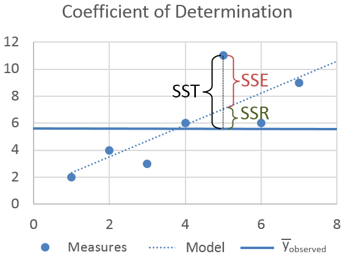

---
output:
  pdf_document:
    latex_engine: xelatex
---

## Student ID: 112077423

```{r message=FALSE}
library(compstatslib)
library(data.table)
library(ggplot2)
library(tidyr)
library(dplyr)
library(lsa)
```

## Question 1

**(a)** Scenario 1 has a stronger R-squared

**(b)** Scenario 3 has a stronger R-squared

**(c)** Scenario 1 has a smaller SSE and SST. SSR should be relatively the same for both cases.

**(d)** Scenario 3 has a smaller SSE and SST. SSR should be relatively the same for both cases.



## Question 2(a)

```{r}
df <- read.csv("programmer_salaries.txt", sep="\t")
head(df)
```

```{r}
model <- lm(Salary ~ Experience + Score + Degree, data=df)
summary(model)
```

The beta coefficients:

- Intercept:    7.9448
- Experience:   1.1476
- Score:        0.1969
- Degree:       2.2804

R-squared:      0.8181

```{r}
out1 <- 'The first 5 fitted values:\t'
out2 <- head(model$fitted.values, 5)
cat(out1, out2, sep=' ')
cat('\n')
out1 <- 'The first 5 residuals:\t\t'
out2 <- head(model$residuals, 5)
cat(out1, out2, sep=' ')
```

## Question 2(b)

```{r}
# standardized
X <- cbind(1, df$Experience, df$Score, df$Degree)
y <- df$Salary
```

```{r}
beta_hat <- solve(t(X) %*% X) %*% t(X) %*% y
cat('beta_hat:\t', beta_hat)
```

```{r}
y_hat <- X %*% beta_hat
res <- y - y_hat

out1 <- 'The first 5 values of y_hat:\t'
out2 <- head(y_hat, 5)
cat(out1, out2, sep=' ')
cat('\n')
out1 <- 'The first 5 residuals:\t\t'
out2 <- head(res, 5)
cat(out1, out2, sep=' ')
```

```{r}
SSR <- sum((y_hat - mean(y))^2) 
SSE <- sum((y - y_hat)^2) 
SST <- sum((y - mean(y))^2)

out1 <- paste('SSR:\t', SSR)
out2 <- paste('SSE:\t', SSE)
out3 <- paste('SST:\t', SST)
cat(out1, out2, out3, sep='\n')
```

## Question 2(c)

```{r}
r2 <- SSR / SST
r2_ <- cor(y, y_hat)^2

out1 <- paste('Method i R-squared:\t', round(r2,2))
out2 <- paste('Method ii R-squared:\t', round(r2_,2))
cat(out1, out2, sep='\n')
```
As we can see, the results are the same.

## Question 3(a)

```{r}
auto <- read.table("auto-data.txt", header=FALSE, na.strings = "?")
names(auto) <- c("mpg", "cylinders", "displacement", "horsepower", "weight", 
                 "acceleration", "model_year", "origin", "car_name")
# print rows with missing values
print(auto[!complete.cases(auto),])
# fill missing with the mean
#auto[!complete.cases(auto),'horsepower'] <- mean(auto$horsepower, na.rm = TRUE)
```

**(i)**

```{r}
par(mfrow=c(2,2))

plot(density(auto$mpg), col='blue', lwd=1.5, 
     main='Distribution of miles-per-gallon', cex.main = 0.8)
abline(v=mean(abs(auto$mpg)), col='red', lw=2)

plot(density(auto$displacement), col='blue', lwd=1.5, 
     main='Distribution of size of engine', cex.main = 0.8)
abline(v=mean(abs(auto$displacement)), col='red', lw=2)

plot(density(auto$horsepower, na.rm = TRUE), col='blue', lwd=1.5, 
     main='Distribution of power of engine', cex.main = 0.8)
abline(v=mean(abs(auto$horsepower), na.rm = TRUE), col='red', lw=2)

plot(density(auto$acceleration), col='blue', lwd=1.5, 
     main='Distribution of acceleration ability of car', cex.main = 0.8)
abline(v=mean(abs(auto$acceleration)), col='red', lw=2)
```
- The mean of miles-per-gallon is around 24. The distribution is skewed to the right;

- The mean of engine size is slightly less than 200. The distribution is skewed to the right;

- The mean of engine power is slightly greater than 100. The distribution is skewed to the right;

- The mean of acceleration ability of car is slightly greater than 15. The distribution is relatively normal.

```{r}
auto_by_cyl <- auto |>
  count(cylinders)

auto_by_cyl$cylinders <- as.factor(auto_by_cyl$cylinders)

ggplot(auto_by_cyl, aes(x = cylinders, y = n)) +
  geom_bar(stat = "identity") +
  labs(x = '# of cylinders', y = 'count', title = '# of cars by cylinders') +
  theme_minimal()
```

As we can see from the graph, cars with 4 cylinders are the major part of the dataset (>200).

```{r}
pivot <- auto |>
  count(origin)

pivot$origin <- as.factor(pivot$origin)
# 1: USA, 2: Europe, 3: Japan
ggplot(pivot, aes(x = origin, y = n)) +
  geom_bar(stat = "identity") +
  labs(x = 'country', y = 'count', title = '# of cars by year') +
  scale_x_discrete(labels = c('1' = 'USA', '2' = 'Europe', '3' = 'Japan')) +
  theme_minimal()
```

As we can see from the graph, most of the cars are from USA (~250).

**(ii)**

```{r}
tmp_df <- auto[,1:8]
round(cor(tmp_df,  use="pairwise.complete.obs"),2)
```

**(iii)**

From visualizations, we can notice that distributions of the size of the engine and power of the engine are similar to the distribution of miles-per-gallon. From the correlation table, mpg/cylinders, mpg/displacement, mpg/horsepower, and mpg/weight have a strong negative correlation. Besides, mpg and model_year  are correlated in a sense.

**(iv)**

model_year/origin and acceleration/origin might not be linear since their correlation is low.  

**(v)**

cylinders, displacement, weight and horsepower are highly correlated (r > 0.7).

## Question 3(b)

```{r}
model <- lm(mpg ~ weight + model_year + factor(origin) + 
            cylinders + acceleration + horsepower + displacement, data=auto)
summary(model)
```

**(i)** All the independent variables, except cylinders, acceleration, and horsepower, in the model have a ‘significant’ relationship with mpg at 1% significance.

**(ii)** 

factor(origin)2 (JP): change in mpg relative to origin 1 (US)
factor(origin)3 (EU): change in mpg relative to origin 1 (US)

## Question 3(c)

**(i)**

```{r}
# no need to standardize origin since it's categorical
model_ <- lm(scale(mpg) ~ scale(weight) + scale(model_year) + 
            factor(origin) + scale(cylinders) + scale(acceleration) +
            scale(horsepower) + scale(displacement), data=auto)

summary(model_)
```

I find the results of the standardized version to be easier to interpret.

**(ii)**

```{r}
model <- lm(scale(mpg) ~ scale(cylinders), data=auto)
summary(model)
```

```{r}
model <- lm(scale(mpg) ~ scale(acceleration), data=auto)
summary(model)
```

```{r}
model <- lm(scale(mpg) ~ scale(horsepower), data=auto)
summary(model)
```

All three variables become significant when regress mpg over them individually.

**(iii)**

```{r}
# get the residuals of standardized model
residuals <- model_$residuals
plot(density(residuals), col='blue', lwd=1.5, main='Distribution of residuals')
```

Looking at the graph, we can say that residuals are normally distributed in a sense and centered around zero.